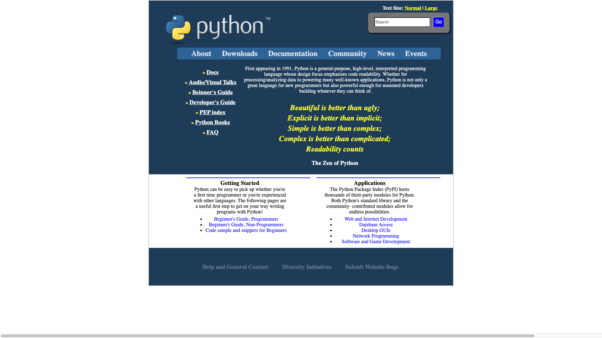

# PythonPage
  A page I created while learning to code at the Coding Dojo. I made a mockup page of what one of the pages from the Python website looks like.

# What I learned
  * Practice in HTML/CSS
  * Design a page similar to a real website
  
# Screenshots

